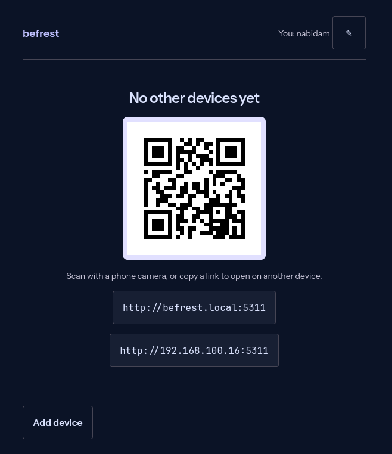
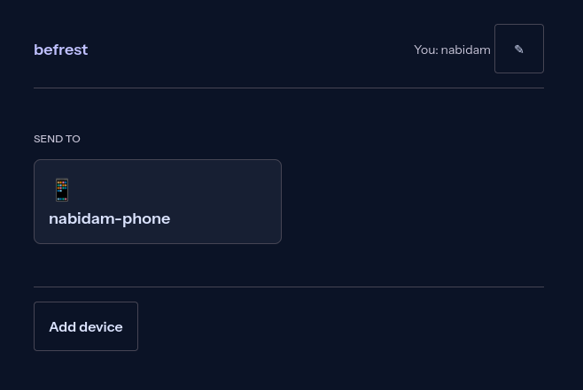
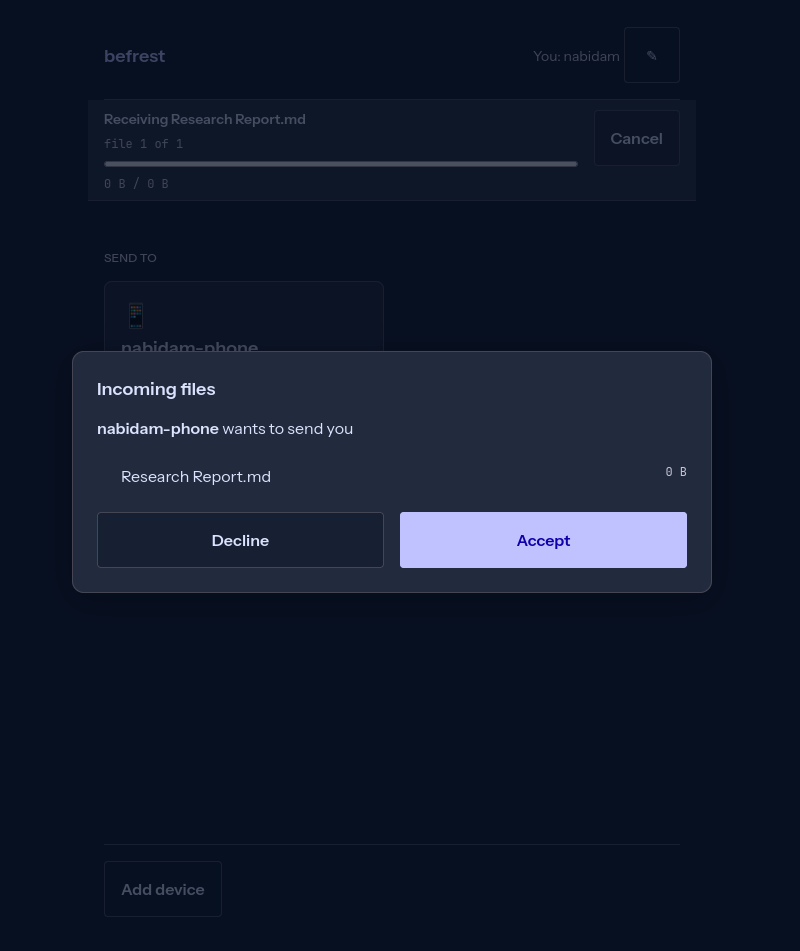

# Befrest

Befrest moves files directly between browsers on the same local network. Run one small hub binary on a computer, then open it from nearby phones and laptops—no account, cloud upload, or installation on the receiving devices.

## Download

Download the binary for your host computer from the [latest release](https://github.com/nabidam/befrest/releases/latest). Current automated builds support Linux (amd64), macOS (Intel and Apple Silicon), and Windows (amd64). Receiving devices only need a modern browser and the same local network.

## Quickstart

1. Download the release binary for the computer that will host the share.
2. Double-click it (or run it from a terminal). Befrest opens in your default browser and shows a QR code.
3. Connect another device to the same Wi-Fi, scan the QR code, choose a name, and tap a device card to send files.

On macOS or Linux, you may need to mark the downloaded binary as executable first:

```sh
chmod +x befrest-darwin-arm64
./befrest-darwin-arm64
```

Keep Befrest running while files transfer. If a firewall prompt appears, allow local-network access.

## Screenshots

The host starts with a QR code and share links for nearby devices.



Once another device joins, choose it from the list to send files.



Recipients review each incoming transfer before accepting or declining it.



## Privacy and security

- Transfers stay on your local network: Befrest has no cloud service, account system, or analytics.
- Files are streamed through the host process and are not written to disk by Befrest.
- Anyone who can reach the host URL on the local network can request or receive transfers. Use it only on networks you trust.
- Befrest serves plain HTTP on the LAN. Do not expose its port to the public internet.

## Command-line flags

| Flag | Default | Purpose |
| --- | --- | --- |
| `--port` | `5311`, then scans upward for a free port | Set the starting listening port for firewall rules or a fixed URL. |
| `--interface` | Automatically ranked local interface | Advertise a specific network interface instead of the automatic choice. |
| `--name` | Operating-system hostname | Set the host device’s displayed name. |
| `--no-open` | Off | Do not open a browser automatically; useful for headless use. |
| `--no-mdns` | Off | Do not announce `befrest.local` on the local network. |

`BEFREST_PORT` is an alternative way to set `--port`; the command-line flag takes precedence.

For example, to run without opening a browser or mDNS announcement:

```sh
./befrest-linux-amd64 --no-open --no-mdns --port 5311
```

## Building from source

Prerequisites: Go 1.25 and Node.js 24 with npm.

```sh
make build
make test e2e
make release
```

`make release` builds a stripped binary for the current operating system and architecture in `dist/release/`. It fails if the binary reaches the 30 MB release-size limit. Producing all platform downloads is intentionally deferred to a native-runner CI release workflow, because the system-tray dependency requires each target platform’s CGO toolchain.

## Contributing and releases

See [CONTRIBUTING.md](CONTRIBUTING.md) for the local verification workflow, [SECURITY.md](SECURITY.md) for vulnerability reporting, and [docs/RELEASING.md](docs/RELEASING.md) for the maintainer release checklist. Befrest is released under the [MIT License](LICENSE).
